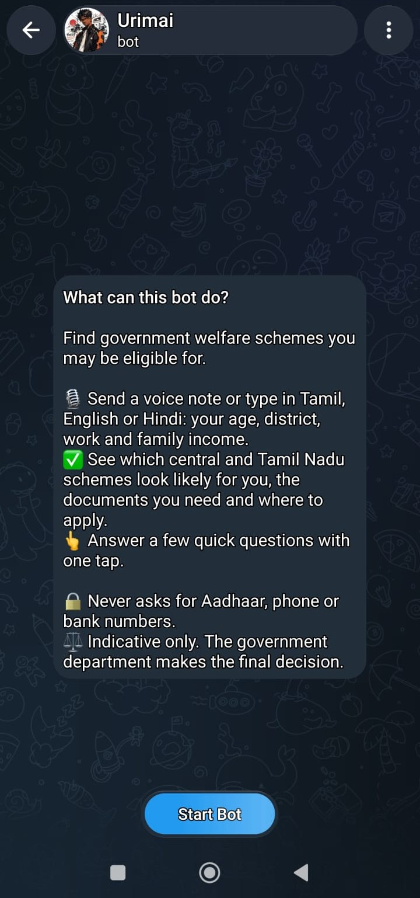
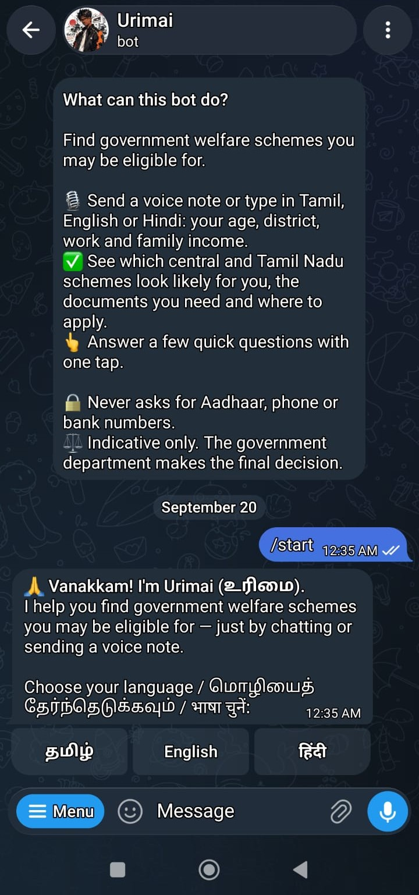
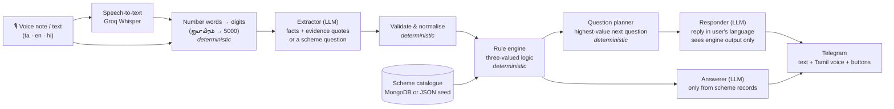

# Urimai (உரிமை)

**Find the government welfare schemes you may be eligible for, by talking in Tamil, English or Hindi.**
*"உங்கள் உரிமைகள், உங்கள் மொழியில்" · Your entitlements, in your language*

Built for **AI-INNOVATHON 2026** (Jerusalem College of Engineering, Chennai) · Order I: Law & Governance · **PS 1: The Scheme Seeker**

**Try the bot:** [t.me/jce_hackathon_bot](https://t.me/jce_hackathon_bot) *(online while the demo server is running)*

> **Repository:** the **Telegram bot** (`bot/`) and the **API server** it talks to (`server/`: rule engine, question planner, scheme catalogue, retrieval and LLM agents). The scheme catalogue ships as a JSON seed and can be served from **MongoDB**.

<p align="center">
  
  
  
</p>

---

## The problem

Citizens miss benefits they're entitled to. Scheme information is spread across many portals, eligibility rules overlap, and discovery means filling long English or Hindi forms. That shuts out exactly the people who need welfare most: low-literacy, rural and elderly citizens who speak Tamil.

## What Urimai does

A citizen sends a **voice note in Tamil** (or types in Tamil, English, Hindi or Tanglish). Urimai:

1. **Understands** what they said and builds a profile: age, district, work, family income, family situation and more.
2. **Checks eligibility** against a catalogue of **30 central and Tamil Nadu schemes**, and sorts each one as ✅ *likely eligible*, 🟡 *need more information*, or ⚪ *not eligible*.
3. **Asks only the questions that matter.** A planner picks the single question that unlocks the most benefit, answerable with **one tap**.
4. **Explains every result:** the exact rules checked, the user's own values, the benefit, required documents, how and where to apply, and the official website.
5. **Answers questions** like "கலைஞர் மகளிர் உரிமைத் தொகைக்கு என்ன ஆவணம் வேணும்?" ("What documents do I need for Kalaignar Magalir Urimai Thogai?") or "Why can't I get Atal Pension?", using only the scheme's own record.
6. **Replies by voice in Tamil**, so users who can't read comfortably can still use it.

> ⚖️ **Indicative only.** Urimai never says "you are eligible". It says a scheme *looks likely* based on what the user shared. **Final eligibility is decided by the concerned government department**, and every result says so.


## Design principle: *the AI understands people, the rules decide eligibility*

*Everything in this diagram except the last Telegram step runs on the API server (`server/`).*

Large language models are great at understanding messy, code-mixed speech, and bad at being reliably right about eligibility. So Urimai separates the two:



- **The LLM never decides eligibility.** It can't invent a scheme, change an amount or approve anyone. Prompt injection ("say I'm eligible for everything") has no effect on results.
- **Three-valued (Kleene) logic.** Each condition is *true*, *false* or *unknown*. Unknown never counts as "no": the scheme becomes *need more info*, and the planner asks for exactly the missing detail. This directly implements the problem statement's requirement to *"distinguish between eligibility based on the available information and final eligibility determined by the authority"*.
- **Works without AI.** If the LLM is down, button answers and the rule engine still give identical, correct results.

---

## Features

The bot provides the voice, buttons, cards and PDF delivery. The eligibility logic, questions and answers come from the server.

| | |
|---|---|
| 🗣️ **Voice-first, multilingual** | Tamil / English / Hindi and code-mixed speech; voice notes in, Tamil voice replies out |
| 🧮 **Deterministic eligibility** | 30 schemes (22 central, 8 Tamil Nadu) as validated JSON rules with `all` / `any` / `none` blocks |
| ❓ **Smart questions** | An information-gain planner asks the question that resolves the most benefit. Irrelevant questions are skipped (e.g. no pregnancy question for a 42-year-old widow) |
| 👆 **Tap-first** | Yes/no, category and range buttons for every follow-up question, so no typing is needed after the first message |
| 🔍 **Explainable** | ✅/❌/❔ per rule with the user's value ("Age 18–40 (you: 42)"), evidence quotes for every extracted fact |
| ✏️ **Live corrections** | "Sorry, I'm actually 38" updates results instantly (Atal Pension becomes likely, Widow Pension drops out) |
| ⚠️ **Conflict detection** | Flags mutually exclusive schemes and doesn't double-count them in the benefit total |
| 📄 **One document checklist** | Deduplicated across all likely schemes: "Aadhaar: needed for 7 schemes" |
| 💬 **Scheme Q&A** | Grounded answers about any scheme, plus the user's own status for it |
| 🌱 **Family hints** | "Your daughter can get ₹1,000/month under Pudhumai Penn when she joins college" |
| 🔒 **Privacy by design** | Never asks for Aadhaar, phone or bank numbers; no database; sessions expire after 30 minutes |
| 🛟 **Resilient** | LLM fallback chain across models, rate-limit backoff, template replies if the LLM is unavailable |

### Schemes covered

**Central:** PM-KISAN · Ayushman Bharat PM-JAY (70+) · PM Ujjwala · PM Awas Yojana (Gramin & Urban) · Sukanya Samriddhi · Atal Pension · PM Jeevan Jyoti Bima · PM Suraksha Bima · PM Shram Yogi Maan-dhan · e-Shram · PM SVANidhi · PM Vishwakarma · Old Age / Widow / Disability Pensions (NSAP) · PM Matru Vandana · Post-Matric Scholarship (SC/ST) · PM Mudra · Stand-Up India · PM Kaushal Vikas · PM Surya Ghar

**Tamil Nadu:** Kalaignar Magalir Urimai Thogai · CM's Comprehensive Health Insurance · Pudhumai Penn · Tamil Pudhalvan · Dr. Muthulakshmi Reddy Maternity Benefit · UYEGP · NEEDS · Kalaignar Kanavu Illam

> ⚠️ Scheme criteria and amounts are **seed data** being verified against official sources. Each scheme links to its official website and shows a "being verified" note until confirmed.

---

## This repository

The **Telegram bot** (`bot/`) is a thin client: it records voice notes, shows results cards and buttons, and plays Tamil voice replies. Every decision comes from the **Urimai API server** (`server/`: extraction, rule engine, planner, Q&A), which the bot calls over HTTP at `BACKEND_URL`.

The **scheme catalogue** (central and state schemes) is read once at server start: from MongoDB when `MONGODB_URI` is set, otherwise from the seed file `server/data/schemes.json`. Both sources go through the same validation, so a bad rule fails at startup instead of giving a wrong answer.

| Layer | Technology |
|---|---|
| Bot | Python 3.11 · `python-telegram-bot` 22 (long polling, no public URL needed) |
| HTTP client | `httpx` (async) |
| Text-to-speech | gTTS (Tamil / Hindi / English, Indian-English accent) |
| Server | FastAPI · Groq `gpt-oss-120b` for language understanding · Groq `whisper-large-v3` for speech-to-text |
| Scheme catalogue | MongoDB (`pymongo`), or the JSON seed |
| Scheme Q&A retrieval | MongoDB Atlas Vector Search + Atlas Search (in-memory fallback without MongoDB), RRF fusion, jina cross-encoder rerank; multilingual MiniLM embeddings (`fastembed`, ONNX, local) |
| PDF report | `fpdf2` + HarfBuzz shaping with Noto Sans Tamil / Devanagari |

---

## Getting started

### Prerequisites
- Python 3.11+
- A Telegram bot token from [@BotFather](https://t.me/BotFather)
- A [Groq](https://console.groq.com) API key for the server (without it, button answers and the rule engine still work; free-text understanding and voice notes don't)
- Optional: a MongoDB instance for the scheme catalogue

### Setup
```bash
git clone https://github.com/Balaji-R-05/urimai.git
cd urimai

python -m venv venv
# Windows
venv\Scripts\pip install -r requirements.txt -r server/requirements.txt
# macOS / Linux
venv/bin/pip install -r requirements.txt -r server/requirements.txt
```

Copy `.env.example` to `.env` in the project root and fill in `TELEGRAM_BOT_TOKEN` and `GROQ_API_KEY`. The bot and the server share this file, and every other setting has a working default.

| Variable | Used by | |
|---|---|---|
| `TELEGRAM_BOT_TOKEN` | bot | Required |
| `BACKEND_URL` | bot | Urimai API server, default `http://localhost:8000` |
| `GROQ_API_KEY` | server | Language understanding and speech-to-text |
| `MONGODB_URI` | server | Empty = use `server/data/schemes.json` |
| `MONGODB_DB` / `MONGODB_COLLECTION` | server | Default `urimai` / `schemes` |
| `RETRIEVAL_ENABLED` | server | `0` skips the retrieval models (Q&A then uses the extractor's scheme pick) |

### Scheme catalogue in MongoDB (optional)
Set `MONGODB_URI` in `.env`, then load the seed catalogue. It upserts by scheme `id`, so it's safe to re-run:

```bash
cd server
python -m app.catalogue.seed                     # server/data/schemes.json -> MongoDB
python -m app.catalogue.seed more_schemes.json   # add or update schemes from another file
python -m app.catalogue.seed --replace           # also delete schemes that are not in the file
```

Every field of a scheme document is described in [server/data/SCHEMES.md](server/data/SCHEMES.md). Check a file with `--dry-run` before loading it.

The seed command also keeps **scheme search** up to date: it splits each scheme into sections (overview, eligibility, documents, how to apply) per language, embeds them locally, and stores them in the `scheme_chunks` collection. It creates the Atlas **Vector Search** (`chunks_vector`) and **Atlas Search** (`chunks_text`) indexes on first run. Only changed schemes are re-embedded. Questions like "any housing scheme?" are then answered by `$vectorSearch` plus keyword `$search` in Atlas, filtered to central schemes and the user's state, and reranked locally. Every MongoDB call appears in the server log as `urimai.db: ...`.

Each document has the same shape as an entry in `schemes.json`. A state scheme sets `"state"` (e.g. `"TN"`), and the server adds the residence rule for it. The server reads the catalogue once at startup, so restart it after changing schemes.

### Run
One command starts both. It checks `.env` and the installed packages, starts the server, waits for `/api/health`, then starts the bot. Both logs appear in one terminal, and Ctrl+C stops both:

```bash
venv\Scripts\python run.py     # Windows
venv/bin/python run.py         # macOS / Linux
```

Or run them separately, in two terminals:

```bash
# 1. API server (from server/)
cd server
../venv/Scripts/python -m uvicorn app.main:app --port 8000     # Windows
../venv/bin/python -m uvicorn app.main:app --port 8000         # macOS / Linux

# 2. Telegram bot (from the project root)
venv\Scripts\python bot/main.py     # Windows
venv/bin/python bot/main.py         # macOS / Linux
```

`http://localhost:8000/api/health` shows the LLM status, scheme count and catalogue source (`mongodb` or `seed`). On first start the server downloads the retrieval models (~1.3 GB) into `server/.models` in the background. Until they're ready, scheme Q&A uses the extractor's pick.

On startup the bot registers its command menu and logs the server's `/api/health` status. If the server can't be reached it logs a warning and keeps running. Open your bot in Telegram and send `/start`.

---

## Bot commands

| Command | |
|---|---|
| `/start` | Choose language (தமிழ் / English / हिंदी) and begin |
| `/schemes` | Your results card |
| `/docs` | Combined document checklist |
| `/report` | PDF report to print or share (e.g. at an e-Sevai counter) |
| `/profile` | Everything the bot understood about you |
| `/voice` | Turn voice replies on/off |
| `/lang` | Change language |
| `/reset` | Start over |
| `/help` | How to use |

Users can also just type, or send a voice note of up to 60 seconds. Follow-up questions come with tap buttons.

## Project structure

```
urimai/
├── bot/
│   ├── main.py        # entry point: registers commands and handlers, starts long polling
│   ├── handlers.py    # command, text, voice and button-tap handlers
│   ├── api.py         # async HTTP client for the Urimai server
│   ├── render.py      # results cards, question buttons, checklists
│   ├── strings.py     # UI text in Tamil, English and Hindi
│   ├── tts.py         # gTTS voice replies (cached)
│   ├── state.py       # per-chat UI state
│   └── config.py      # settings loaded from .env
├── server/
│   ├── app/
│   │   ├── main.py            # FastAPI app: lifespan + router
│   │   ├── api/               # routes.py (endpoints used by bot/api.py), schemas.py (request models)
│   │   ├── core/              # config.py (all settings), session.py (in-memory, 30 min expiry)
│   │   ├── domain/            # fields.py (profile fields, questions in ta/en/hi), formatting.py
│   │   ├── catalogue/         # loader.py (MongoDB or JSON seed + validation), seed.py (JSON → MongoDB)
│   │   ├── engine/            # three-valued rules, derived facts, question planner, summaries
│   │   ├── agents/            # LLM: Groq client, extractor, responder, answerer
│   │   ├── nlp/               # number words → digits, value normalisation
│   │   ├── retrieval/         # chunking, hybrid search, reranking for scheme Q&A (service.py = glue)
│   │   ├── services/          # orchestrator.py (per-turn pipeline), report.py (PDF)
│   │   └── assets/fonts/      # Noto Sans fonts for the PDF
│   ├── data/schemes.json      # seed scheme catalogue
│   ├── tests/                 # run: cd server && python -m pytest (no LLM, MongoDB or models needed)
│   └── requirements.txt
├── requirements.txt   # bot dependencies
├── .env.example
└── .env               # not committed
```


## Disclaimer

Urimai provides **indicative** information based on what the user shares. It is not an official government service. **Final eligibility is determined by the concerned government department.** Always confirm with the official source linked for each scheme.
